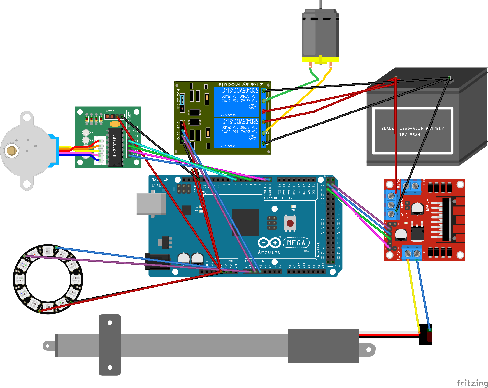

#   RobotFreedomAI 

Welcome to the official robotic control library maintained by HipMonsters.com. This code is designed to help students of all ages get hands on experience with a AgenticAI platform.  

[](https://makeapullrequest.com)
[](https://www.firsttimersonly.com/) 
[](https://discord.com/channels/1213896258876346430/1213896259438649386)


Before you begin:

- This package is designed for a Raspberry Pi but will work on Windows and macOS.

- Given the focus on sensory input and output, a large number of complex packages are required.

## Table of Contents 

- [What's New](#what-is-new)
- [Getting Started](#getting-started)  
- [Installation](#installation) 
  - [RaspberryPi](#raspberrypi) 
  - [OSX](#osx) 
  - [Windows](#windows) 
- [Additional Setup](#additional-setup)
  - [Ollama](#ollama) 
  - [Vosk](#vosk)  
  - [PiperTTS](#pipertts)
  - [Context Data](#context-data) 
- [Sensors](#sensors)
- [Wirings](#wiring)
  - [GPIO](#gpio)
  - [Arudino](#arudino) 
- [Testing](#testing)
- [Older RaspberryPi](#older-raspberrypi)
- [Starting the Robot](#starting-the-robot)
- [Setting Up Autostart](#setting-up-autostart)

## What's New

This is the first alpha release, and there is still a lot of work to be done. 
 

## Getting Started
 
When designing RobotFreedomAI, our educational presentation on robotics, the HipMonster's team wanted to make robotics and artificial intelligence (AI) approachable to a mass audience in hopes of inspiring the creators within all of us. To achieve this, the core principles for our AI are that each robot should have distinct personalities, emotions, and responses.

Given these principles, the foundation of our artificial intelligence framework (shown above) is based on Stimulus Organism Response (S-O-R) Theory. S-O-R theory is a psychological framework that enables researchers to explore how stimuli (such as a bell) can impact an organism's responses, (a dog salivating). Like Pavlov's dog salivating at the sound of a bell, our robots learn and adapt as they experience outside stimuli and are always eager for more. The robot's AI is driven by five personality traits that govern how they interpret and respond to stimuli. Below is how a signal from a sensor (stimuli) flows through our AI (organism) and results in an action (response).
 
Central to the robot's stimuli exploration is a sensor array of ten sensors ranging from sound to touch. When a robot receives a stimulus, it first processes the information based on its preset personality, then uses past experiences to choose a response based on its personality. Below is a color key to the robot's sensor display panel.

These experiences are weighted based on the outcome of the robot's actions allowing the robot to adapt responses to new stimuli. The robots can move, change visual effects, or talk using a chatbot. Below is an image of the robot's cognition graph used to make decisions.

  

## Installation

First, download this repro and unzip it on your Desktop or projects folder. Then, open a terminal and navigate to robot_freedom_ai.

Note: We prefer to not install robot_freedon_ai as a package because this project is primarily a teaching tool not production code. We want people to experiment and change the code on demand and package installations make this difficult.  

The setup is slight different depending on whether you are using OSX, Windows or Linux. The code will run on degraded mode on most platforms but will only be fully functional on a RaspberryPi. 

First, if you do not have Python3 and Pip installed please do before you begin.
 
### RaspberryPI

```bash 
python3 -m venv .venv
source .venv/bin/activate
```


```bash 
sudo apt install memcached libmemcached-tools -y
sudo apt install -y libportaudio2   
sudo apt install -y python3-picamera2
sudo apt-get install git libpcap-dev
sudo apt install -y python3-libcamera python3-kms++ libcap-dev
sudo apt install espeak-ng
sudo apt-get install portaudio19-dev python-pyaudio python3-pyaudio
sudo apt install python3-pyaudio
pip install -r requirements.txt
```
We have had mixed luck with not installing sound and video related packages in a Python venv. If you use the venv and it does not work then you can install all the packages into the system Python using the --break-system-packages command. Most of our robots have used this method and we have never seen any adverse effects.


```bash 
pip install vosk --break-system-packages   
pip install piper-tts --break-system-packages
``` 

### OSX

We have limited support for Apple. The core of the AI works as expected, but the piper-ttk and GPIO is not supported.  


```bash 
sudo apt install memcached libmemcached-tools -y
brew install portaudio
```

Once you have memcache installed the rest of the required packages are fairly straightforward. First setup an Python3 environment.

```bash 
python3 -m venv .venv
source .venv/bin/activate
```

Then install the required packages.  

```bash 
pip install -r requirements.osx.txt
```


### Windows
 
We have limited support for Windows. The core of the AI works as expected but the piper-ttk and GPIO is not supported.  

<a href="https://www.geeksforgeeks.org/how-to-install-memcached-on-windows/"> Here </a> is a great tutorial on installing memcache on Windows.

Once you have memcache installed the rest of the required packages are fairly straightforward. First setup an Python3 environment.

```bash 
python3 -m venv .venv
source .venv/bin/activate
```
Then install the required packages.  
 
```bash 
pip install -r requirements.win.txt
```

## Additional Setup

Several external packages required for RobotFreedom.AI required addition configuration and/or data. 

### Ollama

```bash 
python -m  ollama pull tinyllama
```
test

### Vosk

Vosk is a power voice to text AI that does remarkable well in loud settings (such as a workshop). This package enables out robots to hear. It is power by a pre-trained AI and you need to download a model for it to work. We use vosk-model-small-en-us-0.15 for most of our robots. 
 
<a href="https://huggingface.co/rhasspy/vosk-models/resolve/main/en/vosk-model-small-en-us-0.15.zip"> Download from Hugging Face </a>

Move the downloaded to <your installation path>/robot_freedom_ai/data/voices

```bash 
python -c "from vosk import Model; Model(lang='en-us')" 
```

### PiperTTS

PiperTTS is an advanced text to voice package built on top of espeak. To work you need to download a model file. We recommend the en_US-danny-low.onnx model for Squirrel.

<a href="https://huggingface.co/rhasspy/piper-voices/resolve/main/en/en_US/danny/low/en_US-danny-low.onnx"> Download from Hugging Face</a> 
 
Unzip the downloaded file and move the folder to: <your installation path>/robot_freedom_ai/data/voices

```bash  
python ./test/test_voices.py
```

### Context Data

<a href="https://www.kaggle.com/datasets/sameedatif/tone-analysis"> Download from Kaggle</a> 

Move the downloaded files to: <your installation path>/robot_freedom_ai/data/chat/__default

```bash  
cd <your installation path>/robot_freedom_ai/data/chat/__default
python convert.tone.py
```

<a href="https://www.kaggle.com/datasets/projjal1/human-conversation-training-data"> Download from Kaggle.com</a> 
 

Move the downloaded files to: <your installation path>/robot_freedom_ai/data/chat/squirrel

```bash  
cd <your installation path>/robot_freedom_ai/data/chat/squirrel
python convert.chat.py
```

### Sensors

 - <a href="https://docs.arduino.cc/built-in-examples/sensors/Ping/">Ping Ultrasonic Range Finder</a>
 - <a href="https://docs.sunfounder.com/projects/umsk/en/latest/01_components_basic/12-component_pir_motion.html">PIR motion sensor ( HC-SR501 )</a>
 - <a href="https://store-usa.arduino.cc/products/grove-temperature-humidity-sensor-pro?srsltid=AfmBOoqjxlg_tPKlNdnZoDpeQ5KcJfDbbP8zvOXNB4jlBrv0Uq7mxU_5">Temperature/Humidity Sensor</a>
 - <a href="https://newbiely.com/tutorials/raspberry-pi/raspberry-pi-touch-sensor#google_vignette">Touch Sensor</a>
 - <a href="https://www.raspberrypi.com/documentation/accessories/camera.html">RaspberryPi Camera.</a>
 -  USB A Mini Microphone 
 -  USB A Mini Speaker 

### Wiring 

The sensors are connected directly to the RaspberryPi GPIO. The AI controls the robot's arms and legs using a Arduino connected via USB A. In the future we plan on adding the option for an Arduino to interface with the sensors.
 
## GPIO

Below is the layout for the sensors:

  

### Arduino 

The code for the Arduino is in GitHub <a href="https://github.com/Hip-Monsters/robot_freedom_motion_control/tree/main">here</a>.  

The layout is shown below.

   


## Testing

All the tests directly use the libraries for clarity. Each example assumes you are starting in the root directory of the project.

To test how the robot 'thinks' run cognitive_control.py

```bash
cd ./robot_freemdom_ai/ai 
python cognitive_control.py
``` 
To test  Ollama run:

```bash
cd ./robot_freemdom_ai/ai/models 
python ollama_rf.py
``` 

To test the voise run:

```bash
cd ./robot_freemdom_ai/tools
python voice_test.py
```  


## Older RaspberryPi
 
Ollama does not run or performs too slowly on RaspberryPi < 4. To run on older RaspberryPis, we recommend setting the config to low energy mode.

```bash
nano ./data/config/config.json 
```
Change line 

"low_memory_mode":-1, 
to
"low_memory_mode":1,

Then save by press cntrl o

You can also open the file in any text editor.
 

## Starting the Robot 

To start the robot run the following commands (this assume you installed your packages using --break-system-packages). 

```bash
cd robot_freedom_ai
python3 launcher.py
```

If you set up a Python environment start the robot using these commands. 

```bash
source ~/venv_rf/bin/activate
cd robot_freedom_ai
python3 launcher.py
```

Below is a gif of what to expect:

  

You can control the robot using the console.py app. To start the app using the following code. 

```bash 
python console.py
```

To make your robot talk type in the following command:

```bash 
> speak "Hello" @squirrel

```

Type 'help' to see a list of all available commands.

```bash 
> help  
``` 

## Setting Up Autostart

First use chmod to enable the quick_start.sh script to execute.

```bash 
chmod +x ./quick_start.sh 
nano .quick_start.sh 
```

```bash
sudo nano  /etc/xdg/lxsession/LXDE-pi/autostart
```

You should see something like this:

```bash

@lxpanel --profile LXDE-pi
@pcmanfm --desktop --profile LXDE-pi
#@xscreensaver -no-splash 

```

Add in the following command at the end of the file then save (cntrl o).

```
@lxterminal -e /home/pi/Desktop/robot_freedom_ai/robot_freedom_ai/quick_start.sh

```

Now reboot the machine and robot will start automatically.


